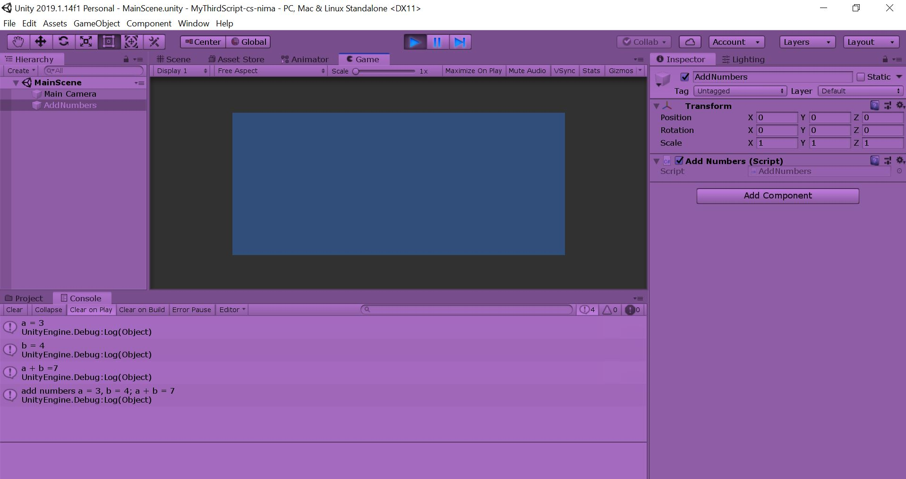

# MyThirdScript-cs-nima

## Project Description:

* Create a new Repository and repeat the whole git/GitHub procedure
* Create Unity project locally and on GitHub
* Use a debug message with the usage of strings and variables

## Developement Platform:

* Windows 10

## Target Platform:

* WebGL (refRes: 1280x720)

## Screenshots:

	

## Lessons Learned:

* Revision of git/GitHub workflow
* Formatting with Markdown
* Usage of strings and variables

### Copyright by nima
